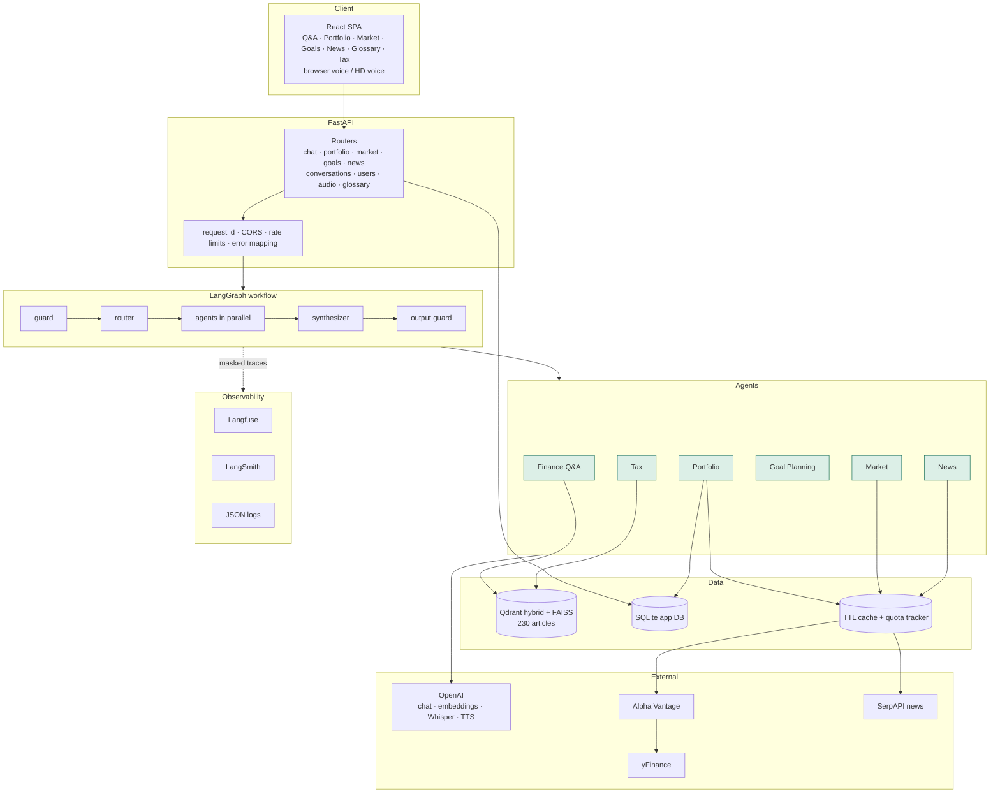
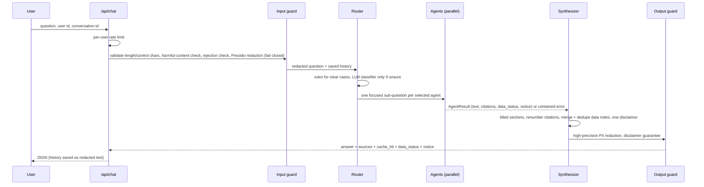

## 2. System architecture

```mermaid
flowchart TB
  subgraph Client
    UI[React SPA<br/>Q&A · Portfolio · Market · Goals · News · Glossary · Tax<br/>browser voice / HD voice]
  end
  subgraph API[FastAPI]
    RT[Routers<br/>chat · portfolio · market · goals · news<br/>conversations · users · audio · glossary]
    MW[request id · CORS · rate limits · error mapping]
  end
  subgraph WF[LangGraph workflow]
    direction LR
    GI[guard] --> RO[router] --> AG[agents in parallel] --> SY[synthesizer] --> OG[output guard]
  end
  subgraph Agents
    QA[Finance Q&A]:::a
    PF[Portfolio]:::a
    MK[Market]:::a
    GP[Goal Planning]:::a
    NW[News]:::a
    TX[Tax]:::a
  end
  subgraph Data
    KB[(Qdrant hybrid + FAISS<br/>230 articles)]
    DB[(SQLite app DB)]
    CH[(TTL cache + quota tracker)]
  end
  subgraph External
    OAI[OpenAI<br/>chat · embeddings · Whisper · TTS]
    AV[Alpha Vantage] --> YF[yFinance]
    SP[SerpAPI news]
  end
  subgraph Obs[Observability]
    LF[Langfuse] & LS[LangSmith] & LG[JSON logs]
  end
  UI --> RT --> MW --> WF
  RT --> DB
  WF --> Agents
  QA & TX --> KB
  PF --> DB
  PF & MK --> CH --> AV
  NW --> CH --> SP
  Agents --> OAI
  WF -.masked traces.-> Obs
  classDef a fill:#dcefe7,stroke:#176f59
```

### Chat request lifecycle

```mermaid
sequenceDiagram
  participant U as User
  participant A as /api/chat
  participant G as Input guard
  participant R as Router
  participant X as Agents (parallel)
  participant S as Synthesizer
  participant O as Output guard
  U->>A: question, user id, conversation id
  A->>A: per-user rate limit
  A->>G: validate length/control chars, harmful-content check, injection check, Presidio redaction (fail closed)
  G->>R: redacted question + saved history
  R->>R: rules for clear cases, LLM classifier only if unsure
  R->>X: one focused sub-question per selected agent
  X-->>S: AgentResult (text, citations, data_status, notice) or contained error
  S->>S: titled sections, renumber citations, merge + dedupe data notes, one disclaimer
  S->>O: high-precision PII redaction, disclaimer guarantee
  O-->>A: answer + sources + cache_hit + data_status + notice
  A-->>U: JSON (history saved as redacted text)
```
